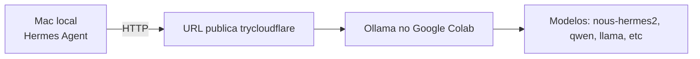

# Tutorial: Hermes Agent Local + Modelos no Google Colab

Este guia mostra como:

1. subir os modelos no Colab com Ollama
2. rodar o Hermes Agent no seu PC local (macOS)
3. apontar o Hermes Agent para a URL publica do Colab

## Visao geral



## 1) Suba os modelos no Colab

1. Abra o notebook [colab_terminal_web.ipynb](colab_terminal_web.ipynb).
2. Execute as celulas na ordem.
3. Na celula que expoe a API do Ollama, copie a URL publica exibida em `Public URL for Ollama API`.

Exemplo de URL:

```text
https://abc-123-xyz.trycloudflare.com
```

## 2) Valide do seu Mac se a API esta online

No terminal local:

```bash
export COLAB_OLLAMA_URL="https://abc-123-xyz.trycloudflare.com"

curl -s "$COLAB_OLLAMA_URL/api/tags"
```

Se retornar JSON com modelos, o link esta ok.

## 3) Instale o Hermes Agent localmente

Como o Hermes Agent pode variar (CLI, app desktop ou extensao), use o instalador oficial que voce ja utiliza. O ponto importante e ele permitir configurar:

1. provider/base URL
2. nome do modelo
3. chave de API (opcional, quando exigido)

No macOS, o fluxo recomendado e:

1. instalar o Hermes Agent (metodo oficial do seu pacote)
2. abrir a tela de configuracao de provider/model
3. preencher com os dados do Colab (proximo passo)

## 4) Configure Hermes Agent para usar o Ollama remoto do Colab

Use estes valores dentro do Hermes Agent:

1. Provider: `Ollama` (ou `OpenAI-compatible`, se essa for a opcao disponivel)
2. Base URL: sua `COLAB_OLLAMA_URL`
3. Modelo: um modelo que ja esteja puxado no Colab, por exemplo:
   - `nous-hermes2:10.7b`
   - `qwen2.5-coder:7b`
   - `llama3.1:8b`
4. API Key:
   - deixe vazio se o Hermes Agent aceitar Ollama sem chave
   - se for obrigatorio, use qualquer valor dummy (ex.: `ollama`) apenas para passar na UI

## 5) Teste rapido no Hermes Agent

Envie um prompt simples:

```text
Responda apenas: conectado com sucesso.
```

Se houver resposta, o link entre Mac local e Colab esta funcionando.

## 6) Diagnostico rapido (quando nao conecta)

1. URL mudou: o `trycloudflare.com` expira quando a sessao do Colab reinicia
2. Modelo nao existe: rode no Colab `ollama list` e confirme o nome
3. Sessao caiu: reexecute as celulas que sobem Ollama e tunnel
4. URL com barra final: remova `/` no fim da Base URL

Teste direto por curl:

```bash
curl -s "$COLAB_OLLAMA_URL/api/generate" \
  -H "Content-Type: application/json" \
  -d '{
    "model": "nous-hermes2:10.7b",
    "prompt": "responda: ok",
    "stream": false
  }'
```

## 7) Quando o tempo do Colab expira: o que fazer

Quando a sessao expira (timeout ou desconexao), isso e esperado no Colab gratuito.

Sinais comuns de expiracao:

1. Hermes Agent para de responder ou retorna erro de conexao
2. a URL `trycloudflare.com` deixa de abrir
3. chamadas `curl` para `/api/tags` falham

Recuperacao rapida (2-3 minutos):

1. reabra o notebook no Colab
2. reconecte a runtime (de preferencia GPU T4)
3. execute novamente as celulas que:
   - instalam/preparam Ollama e cloudflared
   - iniciam Ollama
   - expõem a API publica (nova URL)
4. copie a nova URL `trycloudflare.com`
5. atualize a Base URL no Hermes Agent
6. valide com:

```bash
curl -s "$COLAB_OLLAMA_URL/api/tags"
```

Importante sobre estado da sessao:

1. processos em memoria sao perdidos ao expirar
2. modelos podem precisar ser puxados novamente dependendo do estado da VM
3. variaveis de ambiente e tuneis precisam ser recriados

## 8) Boas praticas

1. use notebook com senha/tunel privado quando houver dados sensiveis
2. considere Colab Pro para sessoes mais longas
3. mantenha 1-2 modelos ativos por vez em GPU T4 para estabilidade

## 9) Atalho de rotina

Sempre que abrir uma nova sessao Colab:

1. subir notebook
2. copiar nova URL publica do Ollama
3. atualizar Base URL no Hermes Agent
4. testar com prompt curto
